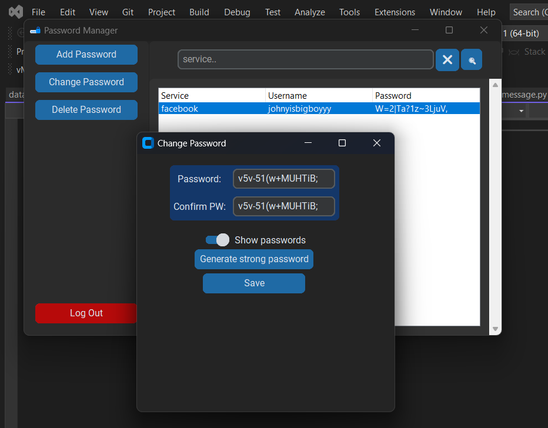

# Password Manager

This password manager is a Python application that allows users to store and manage their passwords securely.
The application includes user authentication, password encryption, and a graphical interface.

## Table of Contents
1. [Application Structure](## Application_structure)
2. [Installation](## Installation)
3. [Usage](## Usage)
4. [Features](## Features)
5. [Example](## Example)

## Aplication structure

* database.py: Establishes a connection to the database.
* base64Logic.py: Contains the Encoder class for encoding and decoding text using a private key and Base64 encoding.
* user_auth.py: Provides functions for registering and authenticating users, as well as obtaining the user ID and encryption key.
* massage.py Provides methods for alerting the user when error is encountered of when confirmation is needed.
* login_register_window.py: Contains the Login class that manages the login and registration interface.
* passwords.py Provides methods for generating strong passwords, encryption and decryption and working withe the database.
* GUI.py Contains the GUI class that includes several method for managing GUI(Graphical User Interface) such as main window of the application,
 or pop-up windows for user interaction.
* main.py: The main file that starts the application.


## Istallation
To run this application, you'll need to have Python 3.6 or higher installed. Additionally, you'll need to install the following packages using pip:

```
mysql-connector-python==8.0.32
customtkinter==5.1.2
bcrypt==4.0.1
passgen==1.1.1
```

Also this project includes requirements.txt file, you can use it to install the packages like this:

```
pip install -r path/to/requirements.txt
```

Before first run, replace the password for root in the "database.py" module. it looks like this:

'''
password = "your root password"
'''

## Usage
This password manager is a multi-window Python application featuring a modern customtkinter GUI. Designed for multiple users, the app starts with a login/register window which provides error handling for incorrect inputs. The application utilizes bcrypt library for password hashing and a MySQL database for secure storage.

Upon successful login or registration, the main window presents a treeview of stored passwords (if any) for the current user. The interface includes a search bar with search and clear buttons for easy navigation, as well as options to add, edit, and delete passwords.

Run "main.py" to start the application. Module "database.py" includes a method that creates a database and tables on your localhost in case it does not already exist.

Use the graphical interface to register a new user or log in to an existing account.
Please note that this application is meant to run on localhost and is not intended for deployment on a public server.


## Freatures

* Multi-user support with secure login and registration functionality
* Customtkinter GUI for a modern and visually appealing interface
* Bcrypt password hashing for enhanced security
* MySQL database storage for user and password information
* Treeview to display and manage stored passwords
* Search functionality to quickly locate specific passwords
* Options to add, edit, and delete passwords
* Strong password generation (16 characters) using the passgen library
* Automatic treeview updates to reflect changes made
* Log out functionality with confirmation prompt to prevent accidental logouts

## Possible improvements

* creating executable file
* adding capabilities to detect login windows and auto-fill or suggestion of password generation
* enabling user to choose generated password length and type (easy to remember, ultra strong, etc.)
* prepare for server deployment
* Two-factor authentication for register using for example smtp for email confirmation
* Cross-platform compatibility
* Cloud sync
* and many other options..

## Example





